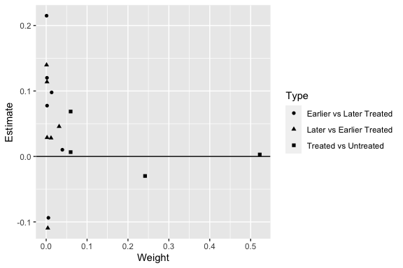

[](https://travis-ci.com/evanjflack/bacondecomp)
[](https://codecov.io/github/evanjflack/bacondecomp?branch=master)
[](https://mybinder.org/v2/gh/evanjflack/bacondecomp/master?filepath=index.ipynb)

<!-- README.md is generated from README.Rmd. Please edit that file -->

# bacondecomp

`bacondecomp` is a package with tools to perform the Goodman-Bacon
decomposition for differences-in-differences with variation in treatment
timing. The decomposition can be done with and without time-varying
covariates.

## Installation

You can install the development version of `bacondecomp` from GitHub:

``` r
library(devtools)
install_github("evanjflack/bacondecomp")
```

## Functions

  - `bacon()`: calculates all 2x2 differences-in-differences estimates
    and weights for the Bacon-Goodman decomposition.

## Data

  - `math_refom`: Aggregated data from Goodman (2019, JOLE)
  - `castle`: Data from Cheng and Hoekstra (2013, JHR)
  - `divorce:` Data from Stevenson and Wolfers (2006, QJE)

## Example

This is a basic example which shows you how to use the bacon() function
to decompose the two-way fixed effects estimate of the effect of an
education reform on future earnings following Goodman (2019, JOLE).

``` r
library(bacondecomp)
df_bacon <- bacon(incearn_ln ~ reform_math,
                  data = bacondecomp::math_reform,
                  id_var = "state",
                  time_var = "class")
#>                       type avg_est  weight
#> 1 Earlier vs Later Treated 0.07117 0.06353
#> 2 Later vs Earlier Treated 0.04117 0.05265
#> 3     Treated vs Untreated 0.01211 0.88382

library(ggplot2)

ggplot(df_bacon) +
  aes(x = weight, y = estimate, shape = factor(type)) +
  geom_point() +
  geom_hline(yintercept = 0) +
  labs(x = "Weight", y = "Estimate", shape = "Type")
```



## References

Goodman-Bacon, Andrew. 2018. “Difference-in-Differences with Variation
in Treatment Timing.” National Bureau of Economic Research Working Paper
Series No. 25018. doi: 10.3386/w25018.

[Paper
Link](https://cdn.vanderbilt.edu/vu-my/wp-content/uploads/sites/2318/2019/07/29170757/ddtiming_7_29_2019.pdf)
